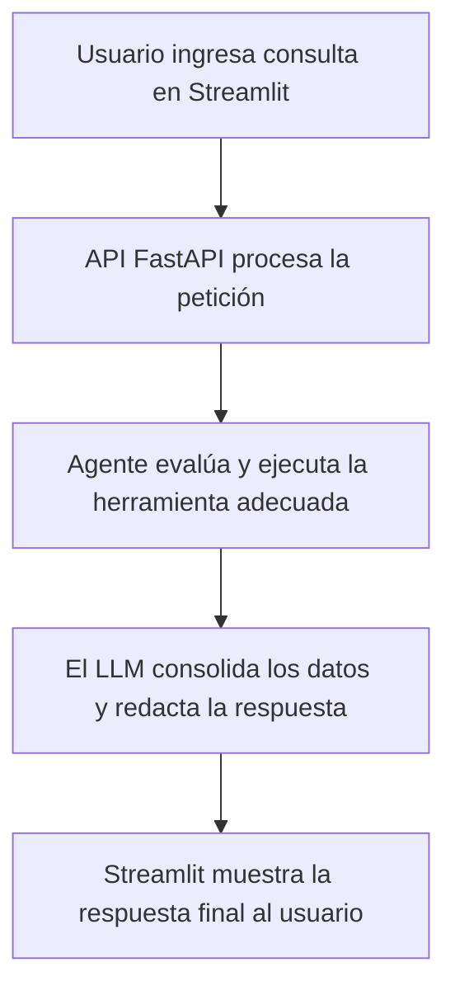
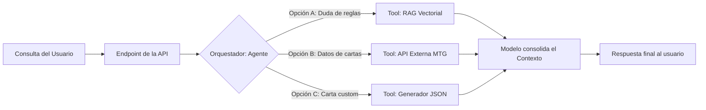

# Documento de Especificación de Arquitectura y Decisiones Técnicas
## Sistema Automatizado de Atención y Soporte — Magic TCG Chatbot

# 1. Contexto Operativo y Objetivos de Negocio
### 1.1 Análisis de la Problemática y Objetivos de Negocio
El cliente opera un centro de atención y soporte técnico automatizado enfocado en la resolución de consultas y asesoramiento para la comunidad de jugadores de Magic: The Gathering. El flujo de soporte clásico se enfrenta a desafíos operativos derivados de la propia complejidad del juego:

* **Complejidad Documental**: El reglamento oficial de juego posee una estructura densa y extensa, lo que ralentiza la localización manual de respuestas precisas (fases del turno, mecánicas de maná, etc.) si se realiza mediante búsquedas tradicionales.

* **Resolución de Casos Avanzados**: La interacción combinada entre mecánicas y cartas específicas (por ejemplo, resolución de prioridades, habilidades como dañar primero o mecánicas como ninjutsu) eleva la complejidad técnica de las consultas recibidas por los usuarios.

* **Dispersión de Fuentes de Información**: Para ofrecer una respuesta de calidad, el sistema debe consultar simultáneamente el reglamento de reglas estáticas y bases de datos externas en tiempo real para verificar atributos e imágenes de los nuevos lanzamientos.

Definición de Alcance: El sistema propuesto se diseña como un asistente conversacional autónomo capaz de unificar múltiples fuentes de información. Su objetivo es absorber y resolver de forma automatizada las consultas sobre reglas básicas, búsquedas y diseño de cartas, centralizando la lógica en una interfaz única y ágil.

## 1.2 Flujo de Ejecución (As-Is / To-Be)

Para resolver estos problemas, he diseñado un flujo de ejecución con el objetivo de eliminar tiempos de espera y automatizar el acceso al conocimiento técnico del juego.

El modelo propuesto funciona bajo un criterio de procesamiento en tiempo real: la aplicación en FastAPI recibe la petición desde el frontend, invoca dinámicamente las herramientas necesarias (RAG para reglamentos o API externa para datos de cartas) y consolida una respuesta estructurada y justificada para el usuario.

### Diagrama



### 1.3 Indicadores de Control del Sistema (Métricas de Seguimiento)

Para evaluar el desempeño del asistente conversacional una vez desplegado, la arquitectura está diseñada para registrar los datos necesarios y calcular las siguientes **métricas de rendimiento**:

| Métrica | Definición | Objetivo Operativo | Mecanismo de Medición |
| :--- | :--- | :--- | :--- |
| **Tasa de Resolución Directa** | Porcentaje de consultas que el bot cierra con una respuesta estructurada exitosa. | Validar la cobertura del asistente frente a la base de conocimiento provista. | Análisis de logs de sesión (conteo de hilos finalizados correctamente). |
| **Tiempo de Gestión (Handling Time)** | Tiempo transcurrido desde el inicio de la consulta hasta su respuesta en pantalla. | Comprobar la agilidad en la entrega de respuestas en comparación con la consulta manual. | Diferencia de marcas de tiempo (*timestamps*) entre el mensaje del usuario y la salida del bot. |
| **Precisión de Respuesta (Accuracy Rate)** | Nivel de correspondencia entre la respuesta del bot y el reglamento oficial. | Garantizar la fiabilidad técnica del sistema y evitar que el modelo alucine reglas. | Auditoría interna mediante un muestreo aleatorio de chats revisados por expertos o jueces del juego. |
| **Latencia del Servidor** | Tiempo promedio que tarda la API FastAPI en procesar y retornar la petición. | Asegurar una experiencia de usuario fluida sin degradación del backend. | Monitorización técnica de los tiempos de respuesta por endpoint. |

**Pasos futuros** Más adelante se podría utilizar herramientas como MLFlow para calcular métricas más avanzadas

## 1.4 Modelo de Integración Operativa

El asistente conversacional se conecta de manera desacoplada con sus interfaces mediante los siguientes criterios de diseño:

  *  **Arquitectura de Interfaz Desacoplada**: El backend expone la lógica mediante servicios REST, lo que permite que el cliente de validación en Streamlit consuma las respuestas de forma independiente, facilitando cambiar el frontend en el futuro sin alterar la lógica de negocio.

  *  **Persistencia de Conversación Local**: Cada hilo de chat mantiene su estado de sesión de forma aislada, garantizando que el usuario pueda encadenar preguntas complejas (como interacciones entre cartas específicas) reteniendo el contexto de los mensajes anteriores.

  * **Estructuración de Datos de Salida**: Las respuestas hacia los clientes web se entregan en formatos estructurados estandarizados, permitiendo adjuntar texto, citas de reglas y enlaces a imágenes procedentes de servicios externos simultáneamente.

## 1.5 Plan de Adopción y Mitigación de Riesgos

* **Despliegue Progresivo**: En la Fase 1, el sistema se valida localmente mediante suites de pruebas unitarias sobre las herramientas (Fase de desarrollo); en la Fase 2, se habilita el acceso a la demo en Streamlit para pruebas de estrés de los usuarios (Fase Piloto); en la Fase 3(Salida a Producción), se consolida el despliegue del servicio completo.

* **Ciclo de Retroalimentación (Feedback Loop)**: Las interacciones del sistema se analizan periódicamente y aquellas consultas con respuestas que requieran ajustes técnicos se almacenan en un repositorio de calidad (Golden Dataset). Estos datos se utilizan para optimizar los prompts y refinar los embeddings sin alterar el código base.

---

# 2. Decisiones de Arquitectura Técnica

## 2.1 Modelo Principal y Orquestador (LLM)

* **Decisión de diseño**: Modelo llama-3.1-70b-versatile ejecutado sobre la infraestructura de Groq.

* **Motivo**: En servicios de atención al cliente, la latencia es un factor crítico. La arquitectura de Groq (LPUs) optimiza la velocidad de generación de tokens, ofreciendo respuestas en tiempos inferiores a los 2 segundos, lo que asegura una experiencia de usuario fluida.

* **Estrategia para Casos Complejos (Lógica Multietapa)**: Aquellas consultas que requieran un razonamiento lógico avanzado sobre el reglamento (como interacciones complejas de cartas y habilidades encadenadas) son identificadas por un componente enrutador. En producción, estas peticiones se derivan de forma dinámica hacia un modelo frontera con mayor capacidad de razonamiento lógico (como Claude 3.5 Sonnet o OpenAI o1/o3) para garantizar la precisión técnica.

## 2.2 Modelo de Embeddings

* **Decisión de diseño**: Uso de sentence-transformers/all-MiniLM-L6-v2 ejecutado de manera local.

* **Motivo**: Dado que el reglamento de juego es un documento estático con actualizaciones de baja frecuencia, la generación de embeddings se realiza de forma centralizada al desplegar el software. Ejecutar este proceso en local elimina dependencias de red externas, mitiga caídas de servicio y suprime costes por API recurrentes durante la fase de análisis.

## 2.3 Base de Datos Vectorial (Vector Store)

* **Decisión de diseño**: Implementación de Chroma DB con almacenamiento persistente en disco (persist_directory).

* **Motivo**: Satisface la necesidad de indexación y persistencia de datos sin incurrir en costes de infraestructura cloud durante la validación de la demo. El sistema comprueba la existencia de la base de datos indexada en disco antes de inicializar los servicios, optimizando el tiempo de arranque del servidor.

## 2.4 Estrategia de Segmentación de Documentos (Chunking)

* **Decisión de diseño**: Segmentación mediante RecursiveCharacterTextSplitter con un tamaño de bloque (chunk_size) de 500 caracteres y un solapamiento (chunk_overlap) de 50 caracteres.

* **Motivo**: Este enfoque previene la pérdida de contexto semántico en los límites divisorios del documento. El sistema recupera los 4 bloques con mayor similitud de coseno por consulta para proveer un contexto denso y conciso al LLM.

## 2.5 Gestión del Estado y Memoria Conversacional

* **Decisión de diseño**: Ventana deslizante de retención (Window Buffer Memory) configurada en k=10 turnos a través de RunnableWithMessageHistory.

* **Motivo**: Limitar el contexto a los últimos 10 intercambios acota el consumo de tokens por llamada de manera predecible, impidiendo la degradación del rendimiento por acumulación de historial, mientras se cubre la duración media de una sesión de soporte estándar.

## 2.6 Diseño y Exposición de la API

* **Decisión de diseño**: Exposición de servicios mediante un endpoint único POST /api/v1/chat desarrollado sobre el framework FastAPI.

* **Motivo**: Un endpoint unificado y desacoplado facilita la integración futura con múltiples canales de mensajería (WhatsApp, Web, etc.) sin alterar las capas core de la aplicación.

**Próximos pasos**: 
* **Capa de Privacidad (PII Masking)**: Se incluye un middleware encargado de detectar y anonimizar información confidencial o sensible que el usuario introduzca involuntariamente, asegurando el cumplimiento normativo de protección de datos (RGPD). 

## 2.7 Arquitectura del Agente Inteligente

**Decisión de diseño**: Agente basado en llamadas a funciones nativas (Tool-Calling Agent) encargado de coordinar tres herramientas independientes:

   * **magic_rules_search**: Ejecuta la búsqueda semántica en la base de datos vectorial del reglamento.

   * **card_search**: Consulta la API oficial de magicthegathering.io para validar atributos e imágenes de cartas reales.

   * **card_creator**: Genera estructuras JSON conformes a esquemas predefinidos para la creación de cartas personalizadas.

**Motivo**: El uso de tool-calling nativo ofrece una estabilidad superior frente a las arquitecturas clásicas de tipo ReAct, disminuyendo drásticamente el riesgo de errores sintácticos en la ejecución de las herramientas.

## 2.8 Restricciones y Políticas del Sistema (Guardrails)

El diseño del System Prompt incluye límites estrictos orientados a salvaguardar la calidad del servicio:

   * **Filtro de Dominio**: Rechazo explícito a interactuar en discusiones o consultas ajenas a la temática oficial del juego.

   * **Cita Obligatoria de Fuentes**: El sistema debe referenciar el apartado o regla exacta del manual que respalda la respuesta formulada.

   * **Transparencia Operativa**: Ante escenarios de incertidumbre o ausencia de datos en el PDF, el agente debe declarar la falta de información disponible de manera honesta, evitando inventar reglamentaciones ficticias.

## 2.9 Estructura del Directorio del Proyecto

Para el desarrollo del software he optado por una estructura modular que separa claramente las responsabilidades y facilita el mantenimiento del código:

```text
magic-chatbot/
├── app/
│   ├── api/
│   │   ├── middlewares/          # Anonimización (PII) y Rate Limiting
│   │   ├── routers/
│   │   │   └── chat.py           # Endpoints y enrutamiento de la API
│   │   └── schemas/
│   │       └── chat.py           # Modelos de datos y validación (DTOs)
│   ├── services/
│   │   ├── chat_service.py       # Lógica de negocio y hilos de sesión
│   │   ├── rag_service.py        # Gestión de Chroma DB y lectura de PDF
│   │   └── card_service.py       # Cliente HTTP para API externa de cartas
│   ├── agents/
│   │   ├── magic_agent.py        # Orquestación del Agente Inteligente
│   │   └── tools/                # Módulos de herramientas del bot
│   ├── core/
│   │   ├── config.py             # Configuración centralizada (Pydantic)
│   │   └── constants.py          # Constantes estáticas globales
│   └── main.py                   # Inicialización de FastAPI
├── tests/                        # Pruebas unitarias y de integración
├── frontend/
│   └── streamlit_app.py          # Interfaz gráfica de la demo (Streamlit)
├── data/
│   └── magic_rules.pdf           # Reglamento técnico oficial de Magic
├── .env                          # Variables de entorno locales (Oculto)
├── .env.example                  # Plantilla pública de credenciales
└── requirements.txt              # Dependencias del proyecto
```

# 3. Arquitectura Orientada a Producción
## 3.1 Diagrama de Componentes de Extremo a Extremo

### Diagrama



## 3.2 Estrategia de Monitorización y Observabilidad

Para asegurar que el sistema sea estable y mantenga la calidad en producción, divido la monitorización en tres niveles complementarios:

  *  **Trazabilidad del LLM** (LangSmith / OpenTelemetry): Auditoría completa de la ejecución de las herramientas, midiendo la latencia en la generación de tokens, cuántas veces el bot invoca las APIs externas y el coste económico acumulado por sesión.

  * **Métricas de Infraestructura** (Prometheus + Grafana): Supervisión del rendimiento del servidor, controlando las latencias p95, los códigos de estado HTTP que devuelve la API, la tasa de errores del backend y el consumo de hardware (CPU y memoria RAM).

  *  **Logs de Negocio** (ELK Stack / Datadog): Almacenamiento y procesado de los identificadores de sesión (completamente anonimizados) para analizar cómo interactúan los usuarios y calcular las tasas de resolución real del bot.

## 3.3 Optimizaciones Avanzadas para Producción

* **Caché Semántica con Redis**: Para reducir costes y acelerar las respuestas ante preguntas idénticas o muy similares, he planteado una capa de RedisSemanticCache. Si un usuario hace una pregunta recurrente, el sistema la resuelve directamente desde la memoria caché, evitando llamadas innecesarias y costosas a las APIs de los LLMs.

* **Control del Desplazamiento de Datos** (Data Drift): Como Magic lanza expansiones de cartas de forma periódica, el tipo de preguntas de los usuarios cambiará según la temporada. Para que el sistema no pierda precisión, incluyo una batería de pruebas automatizadas con el framework RAGAS que mide de manera continua la fidelidad de las respuestas (Faithfulness) y la calidad del contexto extraído (Context Precision).

* **Despliegue del Índice Vectorial en Espejo** (Blue/Green): Cuando salga un reglamento nuevo, la actualización de la base de datos de vectores se procesará primero en una colección aislada de respaldo. Una vez que las pruebas automáticas validen que el nuevo índice funciona correctamente, se conmuta el tráfico en tiempo real, evitando tener que tirar el servicio técnico ni un solo segundo.